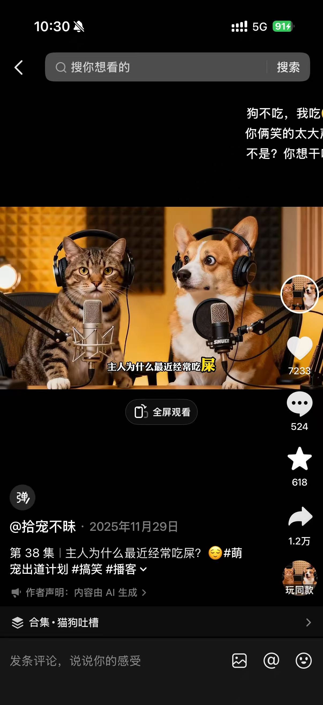
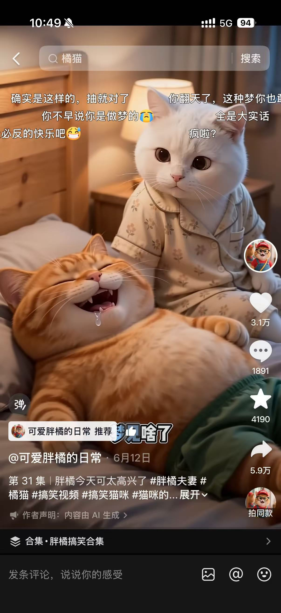
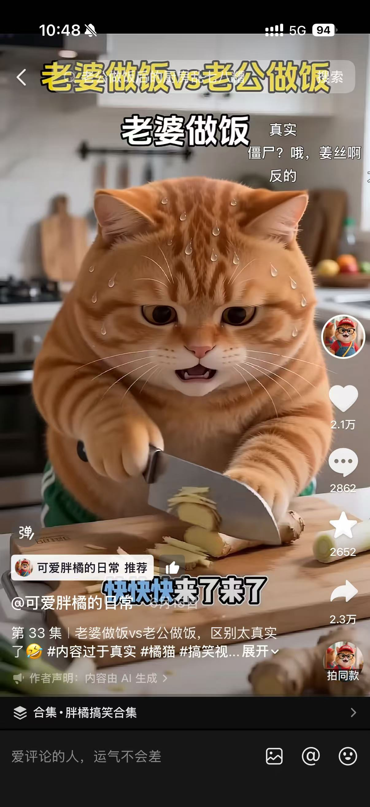
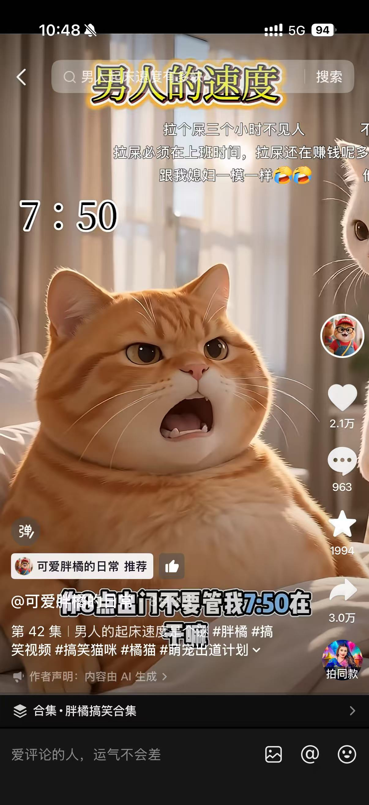
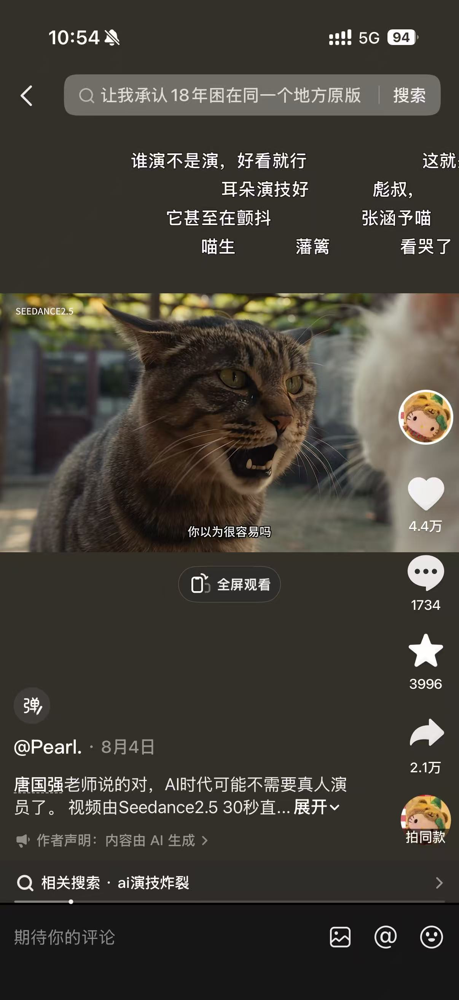
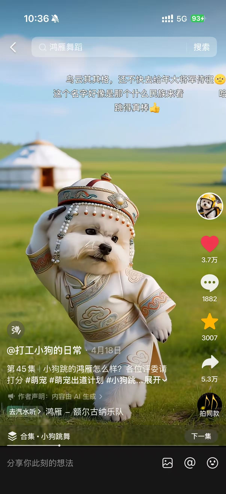

# AI 萌宠类账号单拆汇总

---

## 一、胖橘什么猫

- 平台：抖音
- 抖音号：61189914847
- 粉丝量：1.0 万
- 获赞量：15.8 万
- 内容形态：AI 生成胖橘猫 + 歌舞表演 + 抖音平台 BGM

### 账号特点与爆款公式

**定位**：AI 胖橘猫，靠"歌舞 + 拟人表演"收割情绪价值，不是纯萌宠日常。

**爆款公式**：怀旧经典 BGM × AI 萌宠拟人表演 × "第 X 集"系列化

### 爆款内容清单

#### 1. 第 50 集《又被他帅到了》

- **数据**：1.7 万赞 / 2081 藏 / **3736 转**（转发率 22%）
- **BGM / 模板**：抖音平台 BGM / AI 创意唱演
- **判断**：账号最高赞爆款

#### 2. 第 48 集《爱如潮水》相关

- **数据**：7908 赞 / **4224 转**（转发率 53%）
- **BGM / 模板**：《爱如潮水》/ AI 创意唱演
- **判断**：转发率最高

#### 3. 第 43 集（跳舞）

- **数据**：8352 赞
- **BGM / 模板**：魔性蹦迪模板
- **判断**：爆款

#### 4. 第 46 集《胖橘和胖虎合作表演》

- **数据**：6958 赞 / 1854 转
- **BGM / 模板**："我想要个潇洒的以后" / 萌宠乐器秀
- **判断**：双角色组合，制造新鲜感

#### 5. 第 52 集《街上碰到胖橘在跳舞》

- **数据**：887 赞 / 228 藏 / 136 转
- **BGM / 模板**：抖音平台 BGM / AI 萌宠卡点跳舞
- **判断**：同模板近期样本，数据远低于第 43 集，说明同款模板也会疲劳

#### — 第 45 集《真正的太极刚劲十足》（反面）

- **数据**：**437 赞**（反面）
- **BGM / 模板**：AI 丝滑太极
- **判断**：**明显跑输**，调性错配

**爆款判断依据**：歌舞线稳定 6000+ 赞、转发率 22%–53%；同账号切"武术太极"仅 437 赞，说明用户只认"萌贱歌舞"这一种预期。

---

## 二、拾宠不昧

- 平台：抖音
- 抖音号：43900322217
- 粉丝量：1.7 万
- 获赞量：67.7 万
- 内容形态：猫狗双人播客 + 吐槽 + 即梦 Seedance2.0

### 账号特点与爆款公式

**定位**：猫狗搭档坐在录音棚里播客/吐槽，表演型对话，靠段子与萌贱反应博转发。

**爆款公式**：猫狗双人吐槽 × 播客场景 × 猎奇 / 争议话题

### 爆款内容清单

#### 1. 第 38 集《主人为什么最近经常吃屎？》

- **数据**：7233 赞 / 524 评 / 618 藏 / **1.2 万转**
- **模板**：猫狗戴耳机对麦播客、即梦 AI 生成
- **判断**：账号最高转发，标题猎奇 + 台词"狗不吃，我吃"制造荒诞笑点

#### 2. 第 X 集《眼神不错》（大笑截图）

- **数据**：**2.0 万赞** / 315 评 / 538 藏 / 8422 转
- **BGM / 模板**：抖音平台 BGM / 即梦 Seedance2.0
- **判断**：账号最高赞，靠猫狗夸张大笑表情做视觉钩子

#### 3. 第 X 集《肯定很渣》（播客）

- **数据**：2.0 万赞 / 315 评 / 538 藏 / 8422 转（同第 2 条截图不同帧）
- **BGM / 模板**：抖音平台 BGM / 即梦 Seedance2.0
- **判断**：同一爆款的不同画面帧，证明"吐槽对话"是核心

---

## 三、可爱胖橘的日常

- 平台：抖音
- 抖音号：56098129649
- 粉丝量：4.9 万
- 获赞量：109.1 万
- 内容形态：AI 胖橘夫妇 + 夫妻日常情景剧 + 生活段子

### 账号特点与爆款公式

**定位**：用两只猫演"夫妻日常"，把起床、做饭、做梦、吵架等生活段子萌宠化。

**爆款公式**：夫妻日常矛盾 × 胖橘夫妇人设 × "内容过于真实"

### 爆款内容清单

#### 1. 第 31 集《胖橘今天可太高兴了》

- **数据**：**3.1 万赞** / 1891 评 / 4190 藏 / **5.9 万转**
- **模板**：AI 胖橘夫妻床上互动
- **判断**：账号最高赞、最高转，"做梦笑醒"场景触发用户共鸣

#### 2. 第 38 集《老婆做饭 vs 老公做饭，区别太真实了》

- **数据**：2.1 万赞 / 2862 评 / 2652 藏 / 2.3 万转
- **模板**：分屏/同场景对比 + 生活吐槽
- **判断**：强互动话题，评论区自带站队属性

#### 3. 第 82 集《男人的起床速度是个谜》

- **数据**：2.1 万赞 / 963 评 / 1994 藏 / 3.0 万转
- **模板**：起床场景 + 时间字幕 + 夫妻吐槽
- **判断**：同一"夫妻日常"母题的再演绎，数据稳定

---

## 四、Pearl.

- 平台：抖音
- 抖音号：92581278016
- 粉丝量：5847
- 获赞量：70.7 万
- 作品数：11
- 内容形态：Seedance2.5 原创 AI 短剧 + 萌宠 cosplay 经典影视

### 账号特点与爆款公式

**定位**：用一只猫演高完成度 AI 短剧，复刻蜘蛛侠、武侠、百变小樱、经典台词名场面，靠"萌 + 演技"破圈。

**爆款公式**：经典影视/动漫 IP 场景 × 萌宠主角 × Seedance2.5 电影感

### 爆款内容清单

#### 1. 《妈，我要去闯荡江湖了》

- **数据**：**33.1 万赞** / 9739 评 / 1.9 万藏 / **30.7 万转**
- **BGM / 模板**：Seedance2.5 / 武侠竹林场景 / 30 秒一镜到底
- **判断**：账号最高赞、最高转；"萌猫大侠"反差感 + 高燃动作戏

#### 2. 《喵的梦想是成为蜘蛛侠》

- **数据**：25.2 万赞 / 6227 评 / 1.1 万藏 / 38.7 万转
- **BGM / 模板**：Seedance2.5 / 蜘蛛侠城市夜景
- **判断**：转发率极高，IP 认知度 + 萌宠飞行镜头形成强烈视觉记忆

#### 3. 《唐国强老师说的对，AI 时代可能不需要真人演员了》

- **数据**：4.4 万赞 / 1734 评 / 3996 藏 / 2.1 万转
- **BGM / 模板**：Seedance2.5 / 经典台词配音
- **判断**：演技向爆款，靠"猫演人戏"话题出圈

#### 4. 《隐藏着黑暗力量的米啊，在我面前显示你真正的力量！》

- **数据**：5.1 万赞 / 1540 评 / 2726 藏 / 5.8 万转
- **BGM / 模板**：Seedance2.5 / 百变小樱魔法少女变装
- **判断**：动漫 IP 还原 + 萌宠变装，评论区"初代萌神"唤起童年记忆

**爆款判断依据**：11 条作品中 3 条 20 万+ 赞、2 条 4–5 万赞；所有爆款都靠"经典场景萌宠化"，Seedance2.5 电影感是核心壁垒。

---

## 五、打工小狗的日常

- 平台：抖音
- 抖音号：177036811
- 粉丝量：3.2 万
- 获赞量：47.0 万
- 内容形态：AI 比熊犬 + 跳舞 / 唱歌 / 戏精日常

### 账号特点与爆款公式

**定位**：一只白色比熊犬的"打工"日常，主打跳舞、唱歌、萌贱吐槽三类内容。

**爆款公式**：萌宠拟人表演 × 爆款 BGM / 抖音模板 × 戏精人设

### 爆款内容清单

#### 1. 第 45 集《小狗跳的鸿雁怎么样？》

- **数据**：**3.7 万赞** / 1882 评 / 3007 藏 / **5.3 万转**
- **BGM / 模板**：《鸿雁》（额尔古纳乐队）/ 民族服饰 AI 跳舞
- **判断**：账号最高赞，民族风 + 可爱反差，中老年与年轻用户通吃

#### 2. 第 X 集《小比熊黑化，跳个复仇摇吧》

- **数据**：3.4 万赞 / 1960 评 / 1.1 万藏 / 7388 转
- **BGM / 模板**：Nhảy cùng kiwi – DJ Ct / 墨镜双枪 AI 跳舞
- **判断**：抖音"复仇摇"热点 + 萌宠黑化反差

#### 3. 第 109 集《你那么多朋友总能 @ 到一个吧？》

- **数据**：2.8 万赞 / 1882 评 / 3482 藏 / 8.3 万转
- **BGM / 模板**：《如果你看不惯我》（犬傲天版）/ AI 萌宠对口型
- **判断**：转发率最高，"@朋友"型社交货币强

#### 4. 第 35 集《小狗摆摊 来碗麻辣串串儿吗？》

- **数据**：142 赞 / 10 评 / 47 藏 / 16 转
- **BGM / 模板**：AI 萌宠麻辣串 / 摆摊场景
- **判断**：弱表演/纯场景展示，数据远低于歌舞线，可作为"场景型"低数据样本参考

#### 6. 第 38 集《小狗体验跳伞的一天》

- **数据**：928 赞 / 53 评 / 260 藏 / 153 转
- **BGM / 模板**：AI 萌宠跳伞 / 极限运动场景
- **判断**：场景有视觉奇观但缺乏强 BGM/强人设情绪，数据低于歌舞爆款但高于摆摊

---

## 六、我们可以复刻的东西（跨账号对比）

**核心原则**：用我们自己的萌宠 IP，跟着每个账号每天更新的内容类型和爆款 BGM 做同款表演，只换角色、场景、文案和音乐。下面「可复刻」指的是**表演形式**，不是具体动物 / 歌曲 / 文案。

| 账号      | 可复刻的表演形式（自有 IP 做同款）        | 内容节奏             |
| ------- | -------------------------- | ---------------- |
| 胖橘什么猫   | 对口型唱经典老歌 / 卡点跳舞 / 萌宠乐器秀    | 跟他的歌舞类型 + 爆款 BGM |
| 拾宠不昧    | 双萌宠坐播客场景吐槽对话               | 跟他的猎奇 / 争议吐槽话题   |
| 可爱胖橘的日常 | 双萌宠演夫妻 / 室友日常段子            | 跟他的夫妻日常母题再演绎     |
| Pearl.  | 自有萌宠演高完成度 AI 短剧（原创 / 公版场景） | 跟他的经典名场面手法       |
| 打工小狗的日常 | 比熊犬跳舞 / 唱歌 / 戏精日常          | 跟他的爆款 BGM + 戏精文案 |

---

## 七、侵权风险（跨账号对比）

### 通用红线（5 个账号全部适用）

- **音乐版权**：抖音平台 BGM 授权范围只限抖音站内，跨平台发到自有微信小程序不生效；BGM 须取自商用授权音乐库或自制曲目。
- **角色形象权**：各账号萌宠均为原创角色，不得 1:1 复刻，须自行设计独立动物形象。
- **声音 / 表演**：不得克隆他人音色；配音与歌声须使用平台授权 AI 音色或自行录制。
- **视频搬运**：不得原片搬运，须替换角色、BGM、场景并重写文案。

