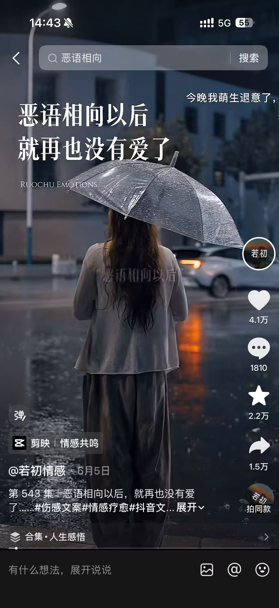
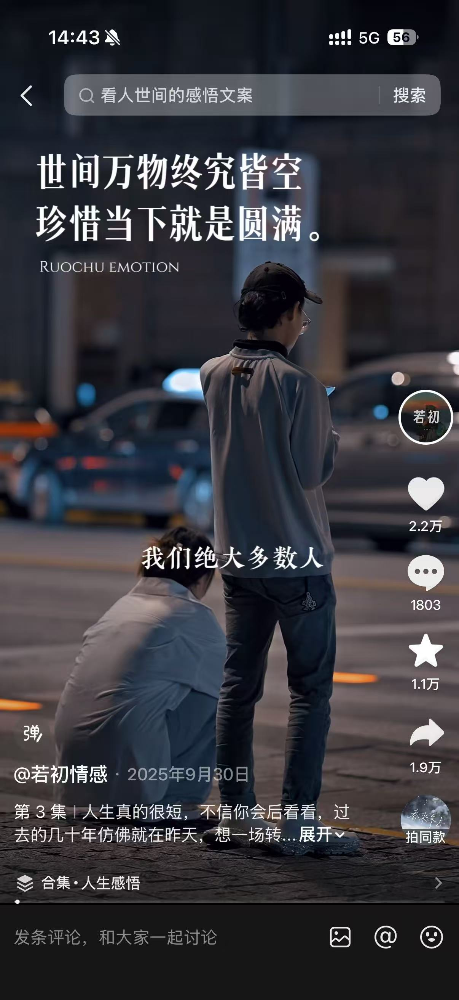
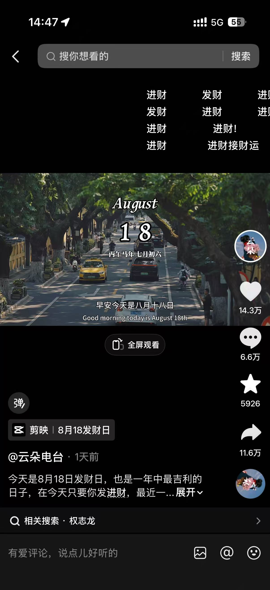
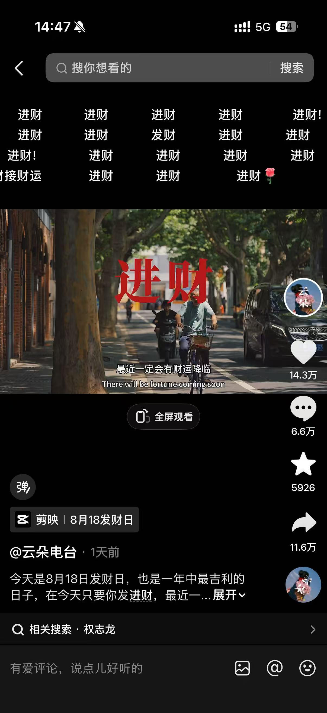
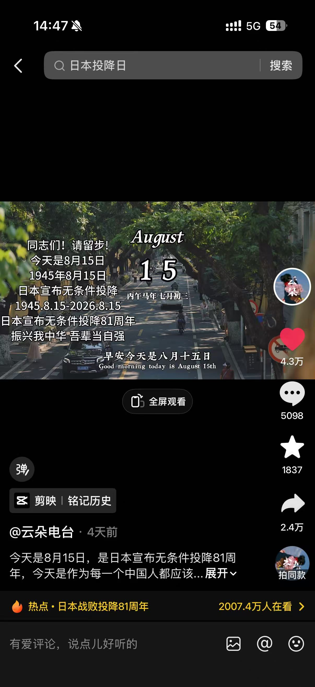
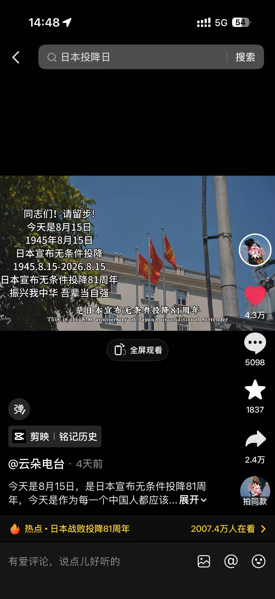

# 情感鸡汤类 · 账号单拆汇总

> 素材来源：`抖音账号/情感鸡汤类视频/`；单账号详细拆解另见 `benchmarks/douyin-若初情感/`、`benchmarks/douyin-云朵电台/`、`benchmarks/情感鸡汤类-复刻路径汇总-2026-08-19.md`。

---

## 一、若初情感（深夜情绪陪伴型）

- 粉丝量：7.3 万
- 获赞量：65.5 万
- 关注：27
- IP / 年龄：广西 / 31 岁
- 内容形态：夜景行人/背影素材 + 温柔女声 + 大字情绪文案 + 情绪共鸣选题

**爆款公式**：温柔低语女声 × 夜景行人/背影素材 × 大字情绪文案 × 痛点共鸣选题

### 1. 《在我最难的时候，谁也没有让我变好》（6 月 8 日）

- **数据**：10.3 万赞 / 7753 评 / 4.2 万藏 / 3.0 万转（收藏率 41%，转发率 29%）
- **BGM / 模板**：抖音平台 BGM / 固定版式（主标题 + RUOCHU EMOTIONS + 滚动字幕）
- **判断**：账号最高赞爆款；女路人背影 + 街灯虚化 + 暖白色大字体，"在我最难的时候，谁也没有让我变好"直击深夜情绪，评论区刷"被治愈了""说得太对了"

### 2. 《恶语相向以后，就再也没有爱了》（6 月 5 日）

- **数据**：4.1 万赞 / 1810 评 / 2.2 万藏 / 1.5 万转（收藏率 54%，转发率 37%）
- **BGM / 模板**：剪映 · 情感共鸣模板
- **判断**：第二梯队爆款；雨夜背影 + 撑伞 + 湿漉漉的街灯，"恶语相向以后，就再也没有爱了"谈关系不可逆伤害，评论区刷"说出了心里话"

### 3. 《世间万物终究皆空，珍惜当下就是圆满》（2025 年 9 月 30 日）

- **数据**：2.2 万赞 / 1803 评 / 1.1 万藏 / 1.9 万转（转发率 86%）
- **BGM / 模板**：抖音平台 BGM / 固定版式（主标题 + RUOCHU EMOTION + 中部字幕）
- **判断**：人生哲理型爆款；男女两人背影看车流，"世间万物终究皆空，珍惜当下就是圆满"传递放下执念的情绪，转发率最高，验证了"释怀类"金句的传播力

---

## 二、云朵电台（早安日签 + 热点型）

- 粉丝量：8093
- 获赞量：67.8 万
- 关注：42
- 作品数：114
- IP / 性别：重庆 / 女
- 内容形态：固定街道绿荫背景 + 日期可视化 + 当日热点/吉语 + 正能量少女声 + 互动指令

**爆款公式**：固定街道背景 × 日期可视化 × 热点/吉语 × 互动指令（评论/转发）

### 1. 《8 月 18 日发财日》（1 天前）

- **数据**：14.3 万赞 / 6.6 万评 / 5926 藏 / **11.6 万转（转发率 81%）**
- **BGM / 模板**：剪映 · 8 月 18 发财日
- **判断**：账号最高赞爆款；顶部铺满"进财""发财"弹幕式文字 + 中间大红色"进财"二字 + August 18 日期版式，"今天发进财，最近一定财运降临"驱动用户@好友/评论接好运

### 2. 《日本投降 81 周年》（8 月 15 日）

- **数据**：4.3 万赞 / 5098 评 / 1837 藏 / 2.4 万转（转发率 56%）
- **BGM / 模板**：剪映 · 铭记历史
- **判断**：历史纪念日爆款；左上竖排"同志们！请留步！今天是 8 月 15 日 1945 年 8 月 15 日..."文案 + 右侧保留日期版式，蹭爱国情绪 + 评论区刷"铭记历史""勿忘国耻"

---

## 三、我们可以复刻的东西（跨账号对比）

| 维度   | 若初情感（深夜情绪陪伴）   | 云朵电台（早安日签 + 热点）       |
| ---- | --------------- | ----------------------- |
| 时间场景 | 深夜（21:00–24:00） | 清晨（6:00–8:00）           |
| 声音   | 温柔低语女声          | 干净正能量少女声                |
| 视觉核心 | 大字情绪文案          | 日期可视化（August + 数字 + 农历） |
| 背景   | 夜景行人/背影         | 固定城市绿荫街道俯拍              |
| 爆款驱动 | 情绪共鸣 → 收藏/转发    | 热点/吉语 + 互动指令 → 转发/评论    |
| 内容循环 | 选题驱动，无固定节奏      | 日历驱动，每日打卡               |
| 爆款公式 | "在我最难的时候..."    | "8 月 18 日发财日"           |

**共性骨架（2 个账号可复用）**：固定视觉模板（通用背景 + 字体 + 字幕位）+ 一个陪伴式声音人设 + 一段情绪文案（钩子主标题 + 30 秒口播：痛点共鸣 → 情绪放大 → 温柔结论）= 可日更、可收藏、可转发。

**两者可合并为一个号**：早安一条（云朵）+ 深夜一条（若初），共用一套模板，换时间模块和声音。

---

## 四、侵权风险（跨账号对比）

- **音乐版权**：抖音平台的 BGM 授权范围只限抖音站内，跨平台发到自有微信小程序不生效；BGM 须取自商用授权音乐库或自制曲目。
- **角色形象权**：若初情感用的夜景行人/背影素材，若用真人需有肖像授权或采用 AI 生成 / 免版税素材库（Pexels / Pixabay / Mixkit）；云朵电台的固定街道若是自拍注意「原创素材」声明。
- **声音/表演**：不得克隆他人真人主播声音；旁白人声须使用 TTS 平台官方授权音色（剪映/魔音工坊/微软晓晓）或真人录制。
- **视频搬运**：不得原片搬运，须替换背景、文案、声音并调整版式细节。