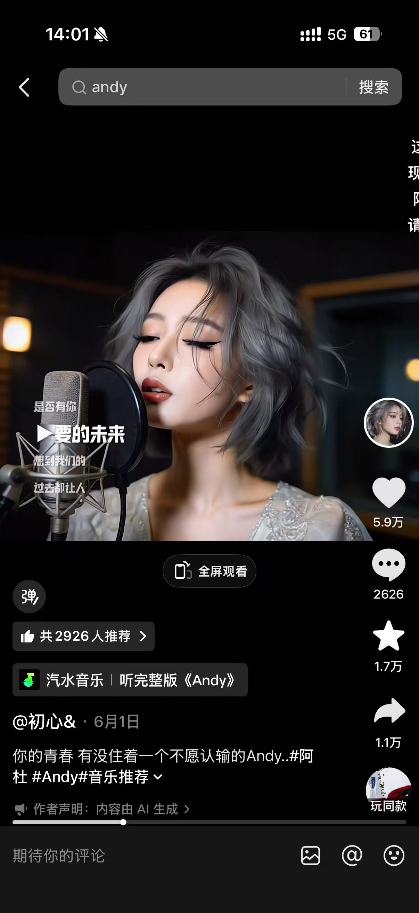

# 数字人唱歌类 · 账号单拆汇总

## 一、张十二（禅意国风型）

- 粉丝量：23.3 万
- 获赞量：306.9 万
- 作品数：743
- 内容形态：固定 AI 僧人 / 小沙弥 + 禅意录音棚 + 梵音/国风改编 + 故事感字幕

**爆款公式**：固定 AI 僧人 × 禅意录音棚 × 梵音/国风改编 × 故事感字幕

### 1. 《野心家》梵音版（6 月 3 日）

- **数据**：15.1 万赞 / 1752 评 / 3.4 万藏 / 3.9 万转（转发率 26%）
- **BGM / 模板**：汽水音乐 · 完整版《野心家》
- **判断**：账号置顶爆款；"小沙弥问：师父，什么是野心？师父说：你敲木鱼时，想敲出..."，故事感开场拉停留

---

## 二、疯子！（舞台女声型）

- 粉丝量：12.3 万
- 获赞量：79.1 万
- 作品数：484
- 内容形态：固定 AI 女歌手 + 录音棚/舞台 + 经典老歌翻唱 + 歌词字幕

**爆款公式**：固定 AI 女歌手 × 舞台录音棚 × 经典老歌翻唱 × 歌词字幕情绪包装

### 1. 《最真的梦》（3 月 7 日）

- **数据**：7.8 万赞 / 2229 评 / 2.5 万藏 / 1.2 万转（转发率 15%）
- **BGM / 模板**：相关搜索 · 最真的梦
- **判断**：账号最高赞作品，置顶第三条；固定卷发女声 + 耳返 + 麦 + 写实舞台光，氛围感强

---

## 三、初心&（烟嗓情绪型）

- 粉丝量：7.0 万
- 获赞量：38.1 万
- 作品数：357
- 内容形态：固定 AI 烟嗓女声 + 录音棚近景 + 经典热歌 cover

**爆款公式**：固定 AI 烟嗓女声 × 录音棚近景 × 经典热歌 cover × 暗调情绪光

### 1. 《Andy》cover（6 月 1 日）

- **数据**：5.9 万赞 / 2626 评 / 1.7 万藏 / 1.1 万转（转发率 19%）
- **BGM / 模板**：汽水音乐 · 完整版《Andy》
- **判断**：账号置顶作品；"你的青春 有没住着一个不愿认输的 Andy..."，怀旧人群精准

**其他作品**：

- **《不再犹豫》cover（7 月 8 日）**：1.2 万赞 / 259 评 / 4687 藏 / 1974 转（转发率 16%）；BGM 相关搜索 · 不再犹豫；"为了梦想，坚持着，也不再犹豫，重拾信心"，情绪向文案延续风格

---

## 四、棉袄伴歌行（双人弹唱型）

- 粉丝量：11.9 万
- 获赞量：78.1 万
- 作品数：121
- 内容形态：固定 AI 父女组合 + 吉他弹唱 + 怀旧温馨场景

**爆款公式**：固定 AI 父女 IP × 吉他弹唱 × 怀旧老歌 × 家居/户外温馨场景

### 1. 《真的爱你》cover（6 月 25 日）

- **数据**：7.9 万赞 / 2812 评 / 2.6 万藏 / 1.2 万转（转发率 15%）
- **BGM / 模板**：汽水音乐 · 真的爱你（live 1996）
- **判断**：Beyond 经典金曲，父女对唱温情反差强；评论区刷"经典永不落"

**其他作品**：

- **《热血颂》（置顶）**：17.9 万赞（账号最高赞）；cover 黎春艳；账号天花板，父女对唱 + 怀旧红歌的爆款公式验证

---

## 五、我们可以复刻的东西（跨账号对比）

**共性骨架（4 个账号可复用）**：固定原创 AI 角色 + 固定表演场景 + 一段音频驱动对口型 + 经典老歌/热歌 cover + 歌词字幕情绪包装。

**RunningHub 上已有的对口型工作流**

| 工作流名称 | 核心能力 |
| --- | --- |
| AI 唱歌数字人对口型 | 单张角色图 + 歌曲音频 → 对口型演唱视频；卡通/写实角色均可 |
| MINIMAX-H3-数字人 | 基于 MiniMax H3 模型，单图 + 音频驱动，动作更自然 |
| 音频驱动数字人对口型 | 通用型：换任意角色图 + 任意音频即可生成 |
| MINIMAXH3 多图数字人 | 支持上传多张参考图（换装/换场景），带货口播/唱歌都能做 |

---

## 六、侵权风险（跨账号对比）

- **音乐版权**：抖音平台的 BGM 授权范围只限抖音站内，跨平台发到自有微信小程序不生效；伴奏 / BGM 须取自商用授权音乐库或自制曲目。
- **声音权（重点）**：严禁使用可识别真人（明星/网红/身边人）的声音进行训练或生成；演唱与配音须使用平台授权 TTS / AI 歌手音色或自行录制干声；发布勾选「内容由 AI 生成」。
- **角色形象权**：4 个对标账号的固定形象（僧人/小沙弥/女歌手/父女）均为原创或受版权保护的角色，不能 1:1 复刻；须使用自行生成的原创 AI 角色，避免写实撞脸明星。
- **视频搬运**：不能原片搬运，须替换角色、音频、场景并重写文案。

