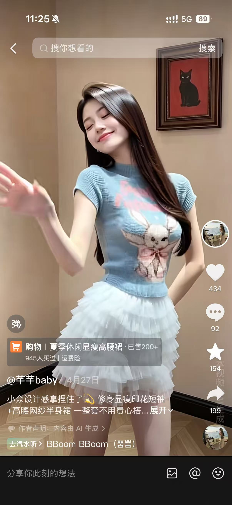
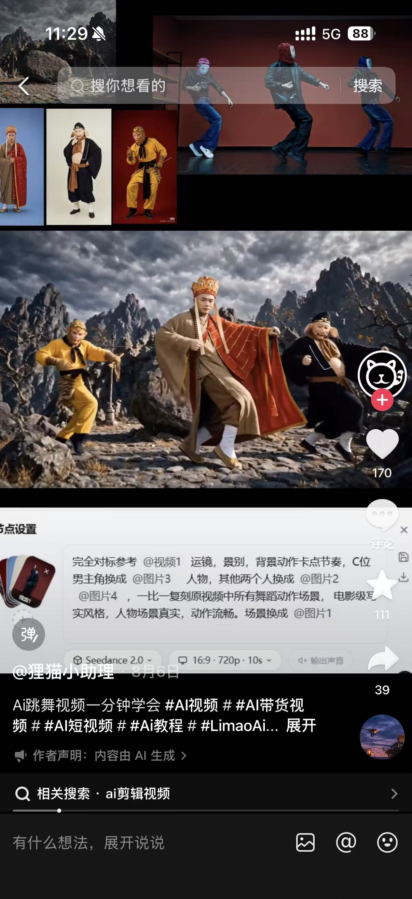
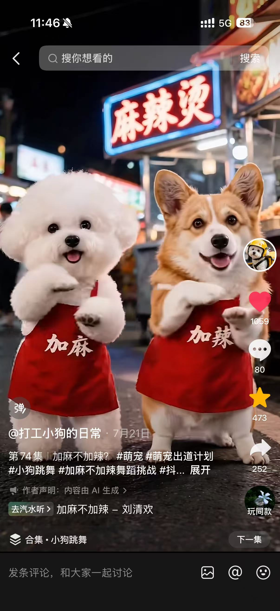

# 数字人跳舞类账号单拆汇总

> 数字人跳舞复刻分两类形态：① **单人动作迁移型**——固定数字人套用爆款动作（如 @芊芊baby）；② **多人团舞型**——同一 IP 的多个角色一起跳同一支舞，比单人更吸睛、更有记忆点。


---

## 一、单人动作迁移型

### 抖音账号：芊芊baby




固定 AI 数字人美女 + 每日换装 + 简单手势舞/摇摆 + 种草带货，靠"低赞高转化"做穿搭电商。**复刻时直接把动作迁移套到自有数字人即可，不用追她的单条爆款**——她验证的是"固定脸 + 换装 + 简单舞 + 带货"这个模式能跑通，动作本身可迁移复用。

---

## 二、多人团舞型（同一 IP 角色同框）

> 核心思路：**同一 IP 的多个角色（你的萌宠家族 / 虚拟偶像组合）一起跳同一支舞，比单人更有视觉冲击和记忆点**。单人只能看一个角色动，多人同框能制造"队形、层次、C 位 + 伴舞"的综艺感，转发属性更强。

**素材佐证（同一支舞多角色同框确实更吸睛）**：

- #jumpstyle：白西装 C 位 + 木乃伊群舞，3D CG 群舞质感最强。
- #三人拖拉机 / #满级病友舞：师徒三人、古装群舞，靠"多角色互动"做反差。
- #正太扭腰舞：牛+豹子跳、小猪围观，群体围观放大"好玩"感。
- #加麻不加辣：比熊+柯基 CP 双主角，比单只更有戏。

**执行要点**：

- **同一套角色三视图**：团舞里每个角色都要用同一份三视图锁定形象，否则换帧就"变脸"，账号没有记忆点。
- **C 位 + 伴舞分工**：1 个主角做精准动作，其余角色做队形/层次变化（参考提示词 B 的 `@图1` C 位、`@图2` 伴舞）。
- **队形变化是看点**：单纯一字排开不够，要设计前后层次、左右分布、移动轨迹（SOP 步骤 4 的"队形变化"）。
- **优先选群舞型热舞**：jumpstyle、满级病友舞、三人拖拉机天然适合多人；单人向的（梦的翅膀 DJ）可加伴舞群扩展成团舞。

---

## 三、最近抖音爆火舞蹈

> 用爆款参考视频锁死动作、运镜和节奏，再替换成自己的角色与场景。每条标注「形态」：单人 / 多人。

#### 1. #jumpstyle 舞蹈 ｜ 多人

- **账号**：@喵笔三花
- **数据**：6403 赞 / 1536 转
- **核心画面**：白西装男主 + 木乃伊群舞 + 埃及古墓场景
- **判断**：3D 游戏 CG 质感 + 西装 C 位 + 恐怖元素伴舞，视觉冲击强


#### 2. #三人拖拉机舞蹈 ｜ 多人

- **账号**：@狸猫小助理
- **数据**：170 赞 / 39 转
- **核心画面**：西游记师徒三人（唐僧/悟空/八戒）跳拖拉机舞
- **判断**：经典影视角色 + 现代魔性舞蹈反差，本账号数据未爆，但形式可参考



#### 3. #梦的翅膀受了伤 DJ（甄嬛版）｜ 单人

- **账号**：@奶茶小肥仔
- **数据**：51.7 万赞 / 82.4 万转
- **核心画面**：陈建斌/雍正形象在雪中独舞
- **判断**："朕的翅膀受了伤"是传播金句；经典角色 + 土味 DJ 反差，转发率 159%


#### 4. #梦的翅膀受了伤 DJ（橘猫版）｜ 单人

- **账号**：@至冬（橘猫版）
- **数据**：27.5 万赞 / 24.5 万转
- **核心画面**：橘猫背书包独舞 + 歌词字幕
- **判断**：萌宠主角 + 悲情 DJ + 歌词字幕梗，情绪反差强，转发率 89%


#### 5. #满级病友舞（古装美女版）｜ 多人

- **账号**：@兰姐 AIGC 无限画布
- **数据**：105 赞 / 28 转
- **核心画面**：唐僧 + 古装美女 / 古装角色群舞
- **判断**："病友"自嘲梗 + 魔性舞步，适合多角色互动，本账号数据未爆


#### 6. #满级病友舞（西游师徒版）｜ 多人

- **账号**：@Can拓界AI
- **数据**：28 赞 / 8 转
- **核心画面**：西游记师徒三人天宫跳舞
- **判断**：同热舞不同角色组合数据更低；说明光有角色反差不够，还需 BGM/梗/发布账号权重


#### 7. #正太扭腰舞 ｜ 多人

- **账号**：@雪碧不熬夜
- **数据**：8809 赞 / 9484 转
- **核心画面**：牛 + 豹子在草原扭腰，后方小猪围观
- **判断**：动物角色 + 扭腰动作 + 群体围观，转发率 108%，"发朋友乐一下"属性强


#### 8. #加麻不加辣舞蹈 ｜ 双人

- **账号**：@打工小狗的日常
- **数据**：1059 赞 / 252 转
- **核心画面**：比熊 + 柯基穿围裙在麻辣烫店前跳舞
- **判断**：萌宠 CP + 街头美食场景 + 文字梗（加麻/加辣），场景感强



---

## 四、我们可以复刻的东西（跨素材对比）

**核心原则**：复刻的是"动作、运镜、节奏、传播触发点"，不是具体角色、BGM、文案。角色、BGM、场景、文案四项必须换，否则会被判搬运。

| 素材         | 形态 | 可复刻的表演形式（自有 IP 做同款）          | 内容节奏             |
| ---------- | -- | ---------------------------- | ---------------- |
| 芊芊baby     | 单人 | 固定数字人 + 每日换装 + 简单手势舞 + 种草标题  | 套动作迁移到自有数字人      |
| #jumpstyle | 多人 | 高完成度 3D CG 角色 + 群舞伴舞 + 电影级场景 | 追热舞 + 跟爆款动作 + 换原创角色/场景 |
| #三人拖拉机     | 多人 | 经典/公版角色 + 现代魔性舞蹈反差           | 追热舞 + 跟爆款动作 + 换原创角色/场景 |
| #梦的翅膀 DJ   | 单人 | 角色 + 悲情 DJ + 歌词字幕梗           | 追热舞 + 跟爆款动作 + 换原创角色/场景 |
| #满级病友舞     | 多人 | 多角色 + 魔性舞步 + 自嘲梗             | 追热舞 + 跟爆款动作 + 换原创角色/场景 |
| #正太扭腰舞     | 多人 | 动物角色 + 扭腰 + 群体围观             | 追热舞 + 跟爆款动作 + 换原创角色/场景 |
| #加麻不加辣     | 双人 | 萌宠 CP + 街头美食场景 + 文字梗         | 追热舞 + 跟爆款动作 + 换原创角色/场景 |

### AI 舞蹈动作迁移 SOP（绿幕白模法 · 5 个关键步骤）

| 步骤 | 关键动作       | 关键注意                                                 |
| -- | ---------- | ---------------------------------------------------- |
| 1  | 选取并预处理参考视频 | 选近 30 天爆款热舞；按 **≤15s** 切段；用人物特效遮挡原人脸，避免生成带脸被判搬运      |
| 2  | 生成绿幕白模动作视频 | 参考视频上传**小云雀自由画布**（**16:9**，时长对齐），输入白模提示词，得到无脸素体动作参考 |
| 3  | 准备替换素材     | ① 角色三视图（锁定主角形象一致性，**团舞需每个角色各一套**）；② 场景图（锁定背景）        |
| 4  | 合并生成最终片段   | 把「白模视频 + 角色图 + 场景图」三合一，输入合并提示词，注意 `@` 准确对应各素材；多段重复此步 |
| 5  | 剪辑拼接 + 配乐  | 多段片段拼接，重新配 BGM，出成品                                   |

### 两个关键提示词

**提示词 A：制作绿幕白模舞蹈动作参考视频**

```
以上传参考视频为唯一基准 1:1 复刻全部舞蹈内容。
全部角色采用 3D 基础红白素体，无脸无五官无头发无服饰无纹理无真实皮肤，
仅保留简洁人形结构与清晰关节，中央主角为红色素体，其余配角为白色素体；
红色素体完全复刻原视频中央主角的全部舞蹈动作，精准匹配脚步、抬手、摆臂、
躯干倾斜、弹跳、重心变化、转向、停顿与定格姿势，
所有白色素体配角严格对应原视频人物，复刻其动作、站位、前后层次、左右分布、
移动轨迹与节奏；所有动作的起始时间、落点、强拍定格、节奏变化均与原视频帧级对齐，
镜头运镜与画面构图完全复刻原视频，背景是绿幕，不新增任何额外元素。
```

**提示词 B：合并视频与图片，生成最终角色替换视频**

```
参考 @视频 的运镜、景别、镜头节奏、音乐卡点和舞蹈编排，
使用 @图1 作为 C 位男主，保持人物外貌、发型、身材和气质高度一致，
高度还原原视频中男主的全部舞蹈动作与节奏；
周边所有伴舞替换成 @图2，场景参考 @场景图，
两侧同步匹配原视频伴舞的动作、站位和队形变化，角色动作严格按照视频里的。
写实真人质感，好莱坞动作音乐大电影，
融合好莱坞歌舞动作大片的镜头语言，动作丝滑流畅，运镜稳定顺滑，节奏精准卡点。
```

---

## 五、侵权风险（跨素材对比）

### 通用红线（全部适用）

- **音乐版权**：抖音平台的 BGM 授权范围只限抖音站内，跨平台发到自有微信小程序不生效；BGM 须取自商用授权音乐库或自制曲目。
- **角色形象权**：芊芊baby 的固定数字人、各热舞里的经典影视角色（唐僧/悟空/八戒、甄嬛/雍正等）均为原创或受版权保护，不能 1:1 复刻；团舞须使用**自有 IP 角色**，不能沿用他人形象。
- **声音/表演**：不能克隆他人音色；配音与歌声须使用平台授权 AI 音色或自行录制。
- **视频搬运**：不能原片搬运，须替换角色、BGM、场景并重写文案。
