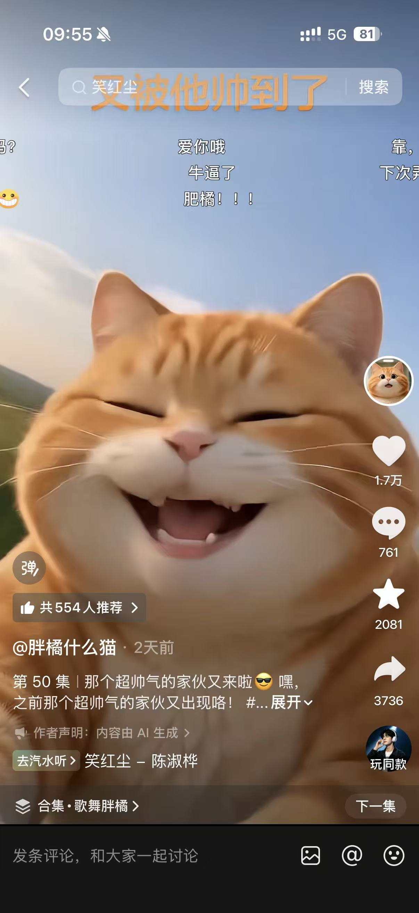
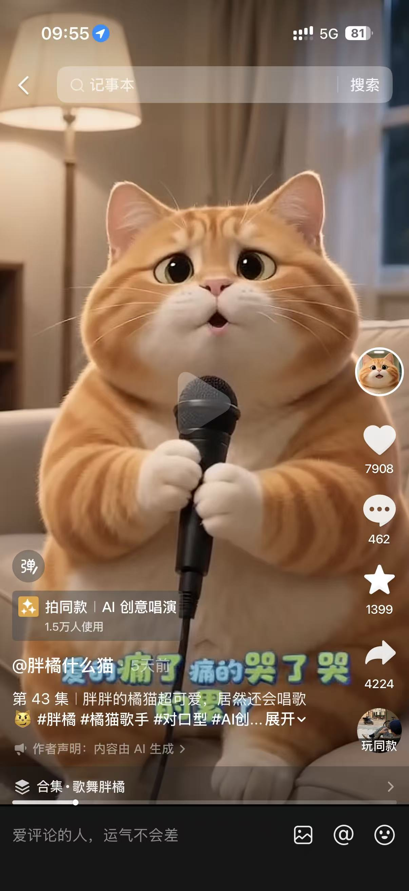
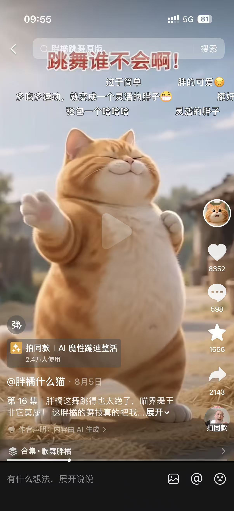
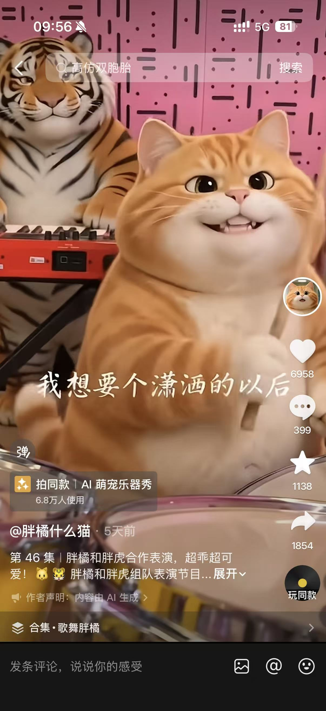
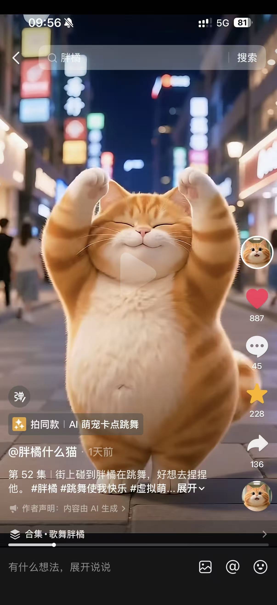
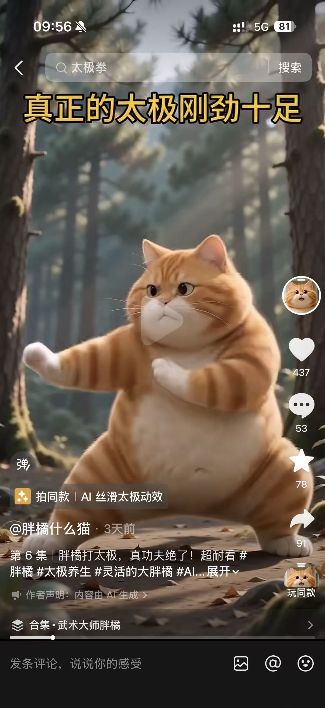

# 账号单拆：胖橘什么猫

- 平台：抖音
- 抖音号：61189914847
- 粉丝量：1.0 万
- 获赞量：15.8 万
- 内容形态：AI 生成胖橘猫 + 歌舞表演 + 经典老歌 BGM
- 拆解日期：2026-08-19

---

## 一、账号特点与爆款公式

**定位**：AI 胖橘猫，靠"歌舞 + 拟人表演"收割情绪价值，不是纯萌宠日常。

**爆款公式**：怀旧经典 BGM × AI 萌宠拟人表演 × "第 X 集"系列化

---

## 二、爆款内容清单

### 1. 第 50 集《又被他帅到了》

- **数据**：1.7 万赞 / 2081 藏 / **3736 转**（转发率 22%）
- **BGM / 模板**：抖音平台 BGM / AI 创意唱演
- **判断**：账号最高赞爆款

### 2. 第 48 集《爱如潮水》相关

- **数据**：7908 赞 / **4224 转**（转发率 53%）
- **BGM / 模板**：《爱如潮水》/ AI 创意唱演
- **判断**：转发率最高

### 3. 第 43 集（跳舞）

- **数据**：8352 赞
- **BGM / 模板**：魔性蹦迪模板
- **判断**：爆款

### 4. 第 46 集《胖橘和胖虎合作表演》

- **数据**：6958 赞 / 1854 转
- **BGM / 模板**："我想要个潇洒的以后" / 萌宠乐器秀
- **判断**：双角色组合，制造新鲜感

### 5. 第 52 集《街上碰到胖橘在跳舞》

- **数据**：887 赞 / 228 藏 / 136 转
- **BGM / 模板**：抖音平台 BGM / AI 萌宠卡点跳舞
- **判断**：同模板近期样本，数据远低于第 43 集，说明同款模板也会疲劳

### — 第 45 集《真正的太极刚劲十足》（反面）

- **数据**：**437 赞**（反面）
- **BGM / 模板**：AI 丝滑太极
- **判断**：**明显跑输**，调性错配

**爆款判断依据**：歌舞线稳定 6000+ 赞、转发率 22%–53%；同账号切"武术太极"仅 437 赞，说明用户只认"萌贱歌舞"这一种预期。

